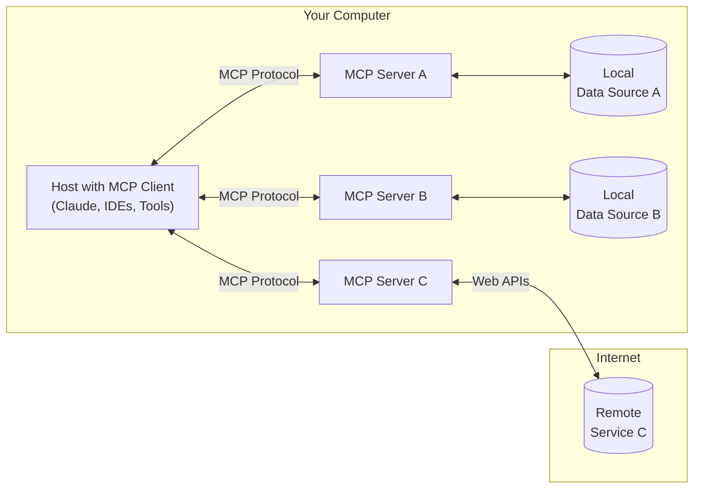

# Introduction

> Get started with the Model Context Protocol (MCP)

<Note>C# SDK released! Check out [what else is new.](/development/updates)</Note>

MCP is an open protocol that standardizes how applications provide context to LLMs. Think of MCP like a USB-C port for AI applications. Just as USB-C provides a standardized way to connect your devices to various peripherals and accessories, MCP provides a standardized way to connect AI models to different data sources and tools.

## Why MCP?

MCP helps you build agents and complex workflows on top of LLMs. LLMs frequently need to integrate with data and tools, and MCP provides:

* A growing list of pre-built integrations that your LLM can directly plug into
* The flexibility to switch between LLM providers and vendors
* Best practices for securing your data within your infrastructure

### General architecture

At its core, MCP follows a client-server architecture where a host application can connect to multiple servers:



* **MCP Hosts**: Programs like Claude Desktop, IDEs, or AI tools that want to access data through MCP
* **MCP Clients**: Protocol clients that maintain 1:1 connections with servers
* **MCP Servers**: Lightweight programs that each expose specific capabilities through the standardized Model Context Protocol
* **Local Data Sources**: Your computer's files, databases, and services that MCP servers can securely access
* **Remote Services**: External systems available over the internet (e.g., through APIs) that MCP servers can connect to

## Get started

Choose the path that best fits your needs:

#### Quick Starts

<CardGroup cols={2}>
  <Card title="For Server Developers" icon="bolt" href="/quickstart/server">
    Get started building your own server to use in Claude for Desktop and other clients
  </Card>

  <Card title="For Client Developers" icon="bolt" href="/quickstart/client">
    Get started building your own client that can integrate with all MCP servers
  </Card>

  <Card title="For Claude Desktop Users" icon="bolt" href="/quickstart/user">
    Get started using pre-built servers in Claude for Desktop
  </Card>
</CardGroup>

#### Examples

<CardGroup cols={2}>
  <Card title="Example Servers" icon="grid" href="/examples">
    Check out our gallery of official MCP servers and implementations
  </Card>

  <Card title="Example Clients" icon="cubes" href="/clients">
    View the list of clients that support MCP integrations
  </Card>
</CardGroup>

## Tutorials

<CardGroup cols={2}>
  <Card title="Building MCP with LLMs" icon="comments" href="/tutorials/building-mcp-with-llms">
    Learn how to use LLMs like Claude to speed up your MCP development
  </Card>

  <Card title="Debugging Guide" icon="bug" href="/docs/tools/debugging">
    Learn how to effectively debug MCP servers and integrations
  </Card>

  <Card title="MCP Inspector" icon="magnifying-glass" href="/docs/tools/inspector">
    Test and inspect your MCP servers with our interactive debugging tool
  </Card>

  <Card title="MCP Workshop (Video, 2hr)" icon="person-chalkboard" href="https://www.youtube.com/watch?v=kQmXtrmQ5Zg">
    <iframe src="https://www.youtube.com/embed/kQmXtrmQ5Zg" />
  </Card>
</CardGroup>

## Explore MCP

Dive deeper into MCP's core concepts and capabilities:

<CardGroup cols={2}>
  <Card title="Core architecture" icon="sitemap" href="/docs/concepts/architecture">
    Understand how MCP connects clients, servers, and LLMs
  </Card>

  <Card title="Resources" icon="database" href="/docs/concepts/resources">
    Expose data and content from your servers to LLMs
  </Card>

  <Card title="Prompts" icon="message" href="/docs/concepts/prompts">
    Create reusable prompt templates and workflows
  </Card>

  <Card title="Tools" icon="wrench" href="/docs/concepts/tools">
    Enable LLMs to perform actions through your server
  </Card>

  <Card title="Sampling" icon="robot" href="/docs/concepts/sampling">
    Let your servers request completions from LLMs
  </Card>

  <Card title="Transports" icon="network-wired" href="/docs/concepts/transports">
    Learn about MCP's communication mechanism
  </Card>
</CardGroup>

## Contributing

Want to contribute? Check out our [Contributing Guide](/development/contributing) to learn how you can help improve MCP.

## Support and Feedback

Here's how to get help or provide feedback:

* For bug reports and feature requests related to the MCP specification, SDKs, or documentation (open source), please [create a GitHub issue](https://github.com/modelcontextprotocol)
* For discussions or Q\&A about the MCP specification, use the [specification discussions](https://github.com/modelcontextprotocol/specification/discussions)
* For discussions or Q\&A about other MCP open source components, use the [organization discussions](https://github.com/orgs/modelcontextprotocol/discussions)
* For bug reports, feature requests, and questions related to Claude.app and claude.ai's MCP integration, please see Anthropic's guide on [How to Get Support](https://support.anthropic.com/en/articles/9015913-how-to-get-support)


# Overview

> Introduction to the Model Context Protocol (MCP) Java SDK

Java SDK for the [Model Context Protocol](https://modelcontextprotocol.org/docs/concepts/architecture)
enables standardized integration between AI models and tools.

<Note>
  ### Breaking Changes in 0.8.x ⚠️

  **Note:** Version 0.8.x introduces several breaking changes including a new session-based architecture.
  If you're upgrading from 0.7.0, please refer to the [Migration Guide](https://github.com/modelcontextprotocol/java-sdk/blob/main/migration-0.8.0.md) for detailed instructions.
</Note>

## Features

* MCP Client and MCP Server implementations supporting:
  * Protocol [version compatibility negotiation](/specification/2024-11-05/basic/lifecycle/#initialization)
  * [Tool](/specification/2024-11-05/server/tools/) discovery, execution, list change notifications
  * [Resource](/specification/2024-11-05/server/resources/) management with URI templates
  * [Roots](/specification/2024-11-05/client/roots/) list management and notifications
  * [Prompt](/specification/2024-11-05/server/prompts/) handling and management
  * [Sampling](/specification/2024-11-05/client/sampling/) support for AI model interactions
* Multiple transport implementations:
  * Default transports (included in core `mcp` module, no external web frameworks required):
    * Stdio-based transport for process-based communication
    * Java HttpClient-based SSE client transport for HTTP SSE Client-side streaming
    * Servlet-based SSE server transport for HTTP SSE Server streaming
  * Optional Spring-based transports (convenience if using Spring Framework):
    * WebFlux SSE client and server transports for reactive HTTP streaming
    * WebMVC SSE transport for servlet-based HTTP streaming
* Supports Synchronous and Asynchronous programming paradigms

<Tip>
  The core `io.modelcontextprotocol.sdk:mcp` module provides default STDIO and SSE client and server transport implementations without requiring external web frameworks.

  Spring-specific transports are available as optional dependencies for convenience when using the [Spring Framework](https://docs.spring.io/spring-ai/reference/api/mcp/mcp-client-boot-starter-docs.html).
</Tip>

## Architecture

The SDK follows a layered architecture with clear separation of concerns:


* **Client/Server Layer (McpClient/McpServer)**: Both use McpSession for sync/async operations,
  with McpClient handling client-side protocol operations and McpServer managing server-side protocol operations.
* **Session Layer (McpSession)**: Manages communication patterns and state using DefaultMcpSession implementation.
* **Transport Layer (McpTransport)**: Handles JSON-RPC message serialization/deserialization via:
  * StdioTransport (stdin/stdout) in the core module
  * HTTP SSE transports in dedicated transport modules (Java HttpClient, Spring WebFlux, Spring WebMVC)

The MCP Client is a key component in the Model Context Protocol (MCP) architecture, responsible for establishing and managing connections with MCP servers.
It implements the client-side of the protocol.


The MCP Server is a foundational component in the Model Context Protocol (MCP) architecture that provides tools, resources, and capabilities to clients.
It implements the server-side of the protocol.


Key Interactions:

* **Client/Server Initialization**: Transport setup, protocol compatibility check, capability negotiation, and implementation details exchange.
* **Message Flow**: JSON-RPC message handling with validation, type-safe response processing, and error handling.
* **Resource Management**: Resource discovery, URI template-based access, subscription system, and content retrieval.

## Dependencies

Add the following Maven dependency to your project:

<Tabs>
  <Tab title="Maven">
    The core MCP functionality:

    ```xml
    <dependency>
        <groupId>io.modelcontextprotocol.sdk</groupId>
        <artifactId>mcp</artifactId>
    </dependency>
    ```

    The core `mcp` module already includes default STDIO and SSE transport implementations and doesn't require external web frameworks.

    If you're using the Spring Framework and want to use Spring-specific transport implementations, add one of the following optional dependencies:

    ```xml
    <!-- Optional: Spring WebFlux-based SSE client and server transport -->
    <dependency>
        <groupId>io.modelcontextprotocol.sdk</groupId>
        <artifactId>mcp-spring-webflux</artifactId>
    </dependency>

    <!-- Optional: Spring WebMVC-based SSE server transport -->
    <dependency>
        <groupId>io.modelcontextprotocol.sdk</groupId>
        <artifactId>mcp-spring-webmvc</artifactId>
    </dependency>
    ```
  </Tab>

  <Tab title="Gradle">
    The core MCP functionality:

    ```groovy
    dependencies {
      implementation platform("io.modelcontextprotocol.sdk:mcp")
      //...
    }
    ```

    The core `mcp` module already includes default STDIO and SSE transport implementations and doesn't require external web frameworks.

    If you're using the Spring Framework and want to use Spring-specific transport implementations, add one of the following optional dependencies:

    ```groovy
    // Optional: Spring WebFlux-based SSE client and server transport
    dependencies {
      implementation platform("io.modelcontextprotocol.sdk:mcp-spring-webflux")
    }

    // Optional: Spring WebMVC-based SSE server transport
    dependencies {
      implementation platform("io.modelcontextprotocol.sdk:mcp-spring-webmvc")
    }
    ```
  </Tab>
</Tabs>

### Bill of Materials (BOM)

The Bill of Materials (BOM) declares the recommended versions of all the dependencies used by a given release.
Using the BOM from your application's build script avoids the need for you to specify and maintain the dependency versions yourself.
Instead, the version of the BOM you're using determines the utilized dependency versions.
It also ensures that you're using supported and tested versions of the dependencies by default, unless you choose to override them.

Add the BOM to your project:

<Tabs>
  <Tab title="Maven">
    ```xml
    <dependencyManagement>
        <dependencies>
            <dependency>
                <groupId>io.modelcontextprotocol.sdk</groupId>
                <artifactId>mcp-bom</artifactId>
                <version>0.9.0</version>
                <type>pom</type>
                <scope>import</scope>
            </dependency>
        </dependencies>
    </dependencyManagement>
    ```
  </Tab>

  <Tab title="Gradle">
    ```groovy
    dependencies {
      implementation platform("io.modelcontextprotocol.sdk:mcp-bom:0.9.0")
      //...
    }
    ```

    Gradle users can also use the Spring AI MCP BOM by leveraging Gradle (5.0+) native support for declaring dependency constraints using a Maven BOM.
    This is implemented by adding a 'platform' dependency handler method to the dependencies section of your Gradle build script.
    As shown in the snippet above this can then be followed by version-less declarations of the Starter Dependencies for the one or more spring-ai modules you wish to use, e.g. spring-ai-openai.
  </Tab>
</Tabs>

Replace the version number with the version of the BOM you want to use.

### Available Dependencies

The following dependencies are available and managed by the BOM:

* Core Dependencies
  * `io.modelcontextprotocol.sdk:mcp` - Core MCP library providing the base functionality and APIs for Model Context Protocol implementation, including default STDIO and SSE client and server transport implementations. No external web frameworks required.
* Optional Transport Dependencies (convenience if using Spring Framework)
  * `io.modelcontextprotocol.sdk:mcp-spring-webflux` - WebFlux-based Server-Sent Events (SSE) transport implementation for reactive applications.
  * `io.modelcontextprotocol.sdk:mcp-spring-webmvc` - WebMVC-based Server-Sent Events (SSE) transport implementation for servlet-based applications.
* Testing Dependencies
  * `io.modelcontextprotocol.sdk:mcp-test` - Testing utilities and support for MCP-based applications.

# Specification

[Model Context Protocol](https://modelcontextprotocol.io) (MCP) is an open protocol that
enables seamless integration between LLM applications and external data sources and
tools. Whether you're building an AI-powered IDE, enhancing a chat interface, or creating
custom AI workflows, MCP provides a standardized way to connect LLMs with the context
they need.

This specification defines the authoritative protocol requirements, based on the
TypeScript schema in
[schema.ts](https://github.com/modelcontextprotocol/specification/blob/main/schema/2025-03-26/schema.ts).

For implementation guides and examples, visit
[modelcontextprotocol.io](https://modelcontextprotocol.io).

The key words "MUST", "MUST NOT", "REQUIRED", "SHALL", "SHALL NOT", "SHOULD", "SHOULD
NOT", "RECOMMENDED", "NOT RECOMMENDED", "MAY", and "OPTIONAL" in this document are to be
interpreted as described in [BCP 14](https://datatracker.ietf.org/doc/html/bcp14)
\[[RFC2119](https://datatracker.ietf.org/doc/html/rfc2119)]
\[[RFC8174](https://datatracker.ietf.org/doc/html/rfc8174)] when, and only when, they
appear in all capitals, as shown here.

## Overview

MCP provides a standardized way for applications to:

* Share contextual information with language models
* Expose tools and capabilities to AI systems
* Build composable integrations and workflows

The protocol uses [JSON-RPC](https://www.jsonrpc.org/) 2.0 messages to establish
communication between:

* **Hosts**: LLM applications that initiate connections
* **Clients**: Connectors within the host application
* **Servers**: Services that provide context and capabilities

MCP takes some inspiration from the
[Language Server Protocol](https://microsoft.github.io/language-server-protocol/), which
standardizes how to add support for programming languages across a whole ecosystem of
development tools. In a similar way, MCP standardizes how to integrate additional context
and tools into the ecosystem of AI applications.

## Key Details

### Base Protocol

* [JSON-RPC](https://www.jsonrpc.org/) message format
* Stateful connections
* Server and client capability negotiation

### Features

Servers offer any of the following features to clients:

* **Resources**: Context and data, for the user or the AI model to use
* **Prompts**: Templated messages and workflows for users
* **Tools**: Functions for the AI model to execute

Clients may offer the following feature to servers:

* **Sampling**: Server-initiated agentic behaviors and recursive LLM interactions

### Additional Utilities

* Configuration
* Progress tracking
* Cancellation
* Error reporting
* Logging

## Security and Trust & Safety

The Model Context Protocol enables powerful capabilities through arbitrary data access
and code execution paths. With this power comes important security and trust
considerations that all implementors must carefully address.

### Key Principles

1. **User Consent and Control**

   * Users must explicitly consent to and understand all data access and operations
   * Users must retain control over what data is shared and what actions are taken
   * Implementors should provide clear UIs for reviewing and authorizing activities

2. **Data Privacy**

   * Hosts must obtain explicit user consent before exposing user data to servers
   * Hosts must not transmit resource data elsewhere without user consent
   * User data should be protected with appropriate access controls

3. **Tool Safety**

   * Tools represent arbitrary code execution and must be treated with appropriate
     caution.
     * In particular, descriptions of tool behavior such as annotations should be
       considered untrusted, unless obtained from a trusted server.
   * Hosts must obtain explicit user consent before invoking any tool
   * Users should understand what each tool does before authorizing its use

4. **LLM Sampling Controls**
   * Users must explicitly approve any LLM sampling requests
   * Users should control:
     * Whether sampling occurs at all
     * The actual prompt that will be sent
     * What results the server can see
   * The protocol intentionally limits server visibility into prompts

### Implementation Guidelines

While MCP itself cannot enforce these security principles at the protocol level,
implementors **SHOULD**:

1. Build robust consent and authorization flows into their applications
2. Provide clear documentation of security implications
3. Implement appropriate access controls and data protections
4. Follow security best practices in their integrations
5. Consider privacy implications in their feature designs

## Learn More

Explore the detailed specification for each protocol component:

<CardGroup cols={5}>
  <Card title="Architecture" icon="sitemap" href="architecture" />

  <Card title="Base Protocol" icon="code" href="basic" />

  <Card title="Server Features" icon="server" href="server" />

  <Card title="Client Features" icon="user" href="client" />

  <Card title="Contributing" icon="pencil" href="contributing" />
</CardGroup>
